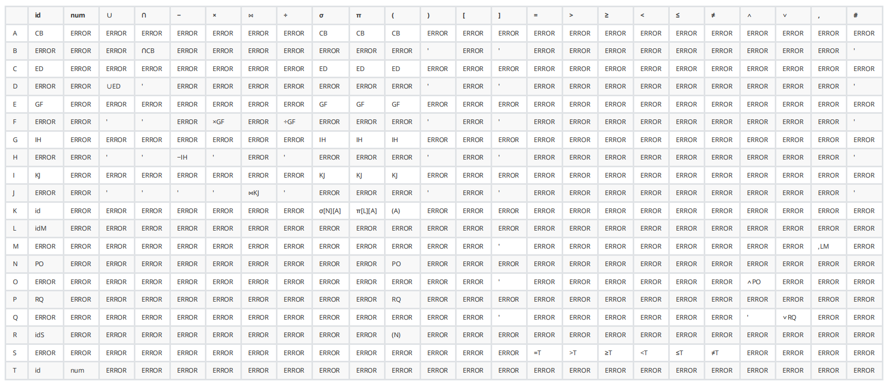

# 详细设计

> 详细设计为每个模块完成的功能进行具体描述，要把功能描述转变为精确的、 结构化的过程描述，并使用流程图和伪代码等方式描述各功能模块。

## 一、全局变量和数据结构设计

### 1.1 全局变量

本程序中定义的全局变量有多个，包含程序执行过程中所需的各种步骤。

#### 关系表

关系表为后端程序中对关系进行持久化的数据结构。当涉及到关系的新增/删除，以及表达式的运算时，均需要与该表进行交互，进行关系的读与写。

该变量定义于接口实现类`RelationServiceImpl`下。呈现形式为Hash表的形式，其中Key为关系名，字符串类型，Value为关系数据结构，RelationBo类型。

```java
private static final ConcurrentHashMap<String, RelationBo> relations;
```

#### 关系运算工具类

运算工具类`ComputingUtil`用于计算关系运算符的结果。其包含了8个对外暴露的方法，分别对应着不同的8种运算符。除此之外有诸多辅助计算方法，用于类内调用。

```java
public class ComputingUtil {

    public static RelationBo and(RelationBo r1, RelationBo r2);

    public static RelationBo or(RelationBo r1, RelationBo r2);

    public static RelationBo diff(RelationBo r1, RelationBo r2);

    public static RelationBo prod(RelationBo r1, RelationBo r2);

    public static RelationBo div(RelationBo r1, RelationBo r2);

    public static RelationBo select(RelationBo r, String condition);

    public static RelationBo project(RelationBo r, int[] cols);

    public static RelationBo join(RelationBo r1, RelationBo r2);
}
```

#### 常量工具类

涉及到的常量主要定义为各运算符在表达式中的表示，符号表达的规则如下。通过`#`号开头以区分当前字符串为关系名还是运算符。

| 运算符 | 含义   | 在字符串的表示  | 举例                     | 说明               |
| --- | ---- | -------- | ---------------------- | ---------------- |
| ∪   | 并    | #or      | A #or B                |                  |
| ∩   | 交    | #and     | A #and B               |                  |
| −   | 差    | #diff    | A #diff B              |                  |
| ×   | 笛卡尔积 | #prod    | A #prod B              |                  |
| σ   | 选择   | #select  | #select[A,条件表达式,1]     | 参数为关系名、条件、固定参数   |
| π   | 投影   | #project | #project[A,name,age,2] | 参数为关系名、投影列名、投影列数 |
| ⋈   | 连接   | #join    | A #join B              | 连接运算仅支持自然连接      |
| ÷   | 除    | #div     | A #div B               |                  |
| (   | 左括号  | (        | -                      | -                |
| )   | 右括号  | )        | -                      | -                |

常量工具类`Constant`对上述运算符进行记录，以及记录一些其它会用到的常量，如运算符优先级、预测分析表等。

```Java
public class Constant {

    // 定义表达式的结束符
    public static final String END_SIGN = "#";

    // OR运算符
    public static final String OR = "#or";

    ...

    // 优先级定义
    public static final Map<String, Integer> PRIORITY;

    ...

    // 预测分析表
    public static final Map<String, Map<String, String>> PREDICTIVE_ANALYSIS_TABLE;
}
```

#### 表达式合法性判断模块

表达性合法性判断模块用于对输入的关系代数表达式进行词法分析以及语法分析，以判断输入表达式的合法性，保障后续计算过程中的正确性。该模块中含两个全局变量，为词法分析模块以及语法分析模块。

```java
    @Resource
    LexicalAnalysisService lexicalAnalysisService;

    @Resource
    ParsingService parsingService;
```

### 1.2 数据结构

#### **后端**

##### 关系表

后端存储关系主要设计两个类，`RelationVo`以及`RelationBo`，前者主要用于与前端交互时存储从前端送来的关系/准备送至前端的关系信息，后者则主要用于后端业务处理，包括关系的存储/表达式的运算等。

鉴于二者相似性，仅详细介绍`RelationBo`的成员，伪代码如下。

```java
RelationBo {

    // 关系行长
    int rowLen;

    // 关系列长
    int colLen;

    // 关系列名
    String[] colName;

    // 关系内容，通过二维数组存储
    String[][] content;

    // bo与vo相互转换的方法
    toRelationVo(RelationBo bo, String name);

    toRelationBo(RelationVo vo, String name);
}
```

##### 常量类

此外，常量类`Constant`，用于统一管理后端程序中用到的常量。

```java
public class Constant {

    public static final String OR = "#or";

    public static final String AND = "#and";

    ...

    public static final Set<String> UNARY_OPERATOR;

    public static final Map<String, Integer> PRIORITY;

    public static final String TEMP_RELATION_PREFIX = "TEMP";

    ...
}
```

##### 预测分析表

预测分析表用于表达式合法性判断过程中的语法分析部分。常见的预测分析表为如下形式，行头和列头都为字符串形式。


考虑到预测分析表的特殊结构，在程序中，我们使用哈希表的形式来表示该数据结构。

```java
    public static final Map<String, Map<String, String>> PREDICTIVE_ANALYSIS_TABLE;
```

##### 符号集合

此外，在一些场合需要对运算符进行分类判断，此时会用到符号集合。根据具体的应用场景，定义了不同的多种符号集合。为便于管理，其统一定义于常量类内。

```java
    // 终结符，在语法分析中使用到
    public static final Set<String> TERMINATOR;
    // 非终结符
    public static final Set<String> NON_TERMINATOR;
```

#### **前后端交互**

前后端交互主要用到两个数据结构。

##### relation 表示关系的数据结构（表）

包含五个字段：关系名、行长、列长、列名以及表的内容。

表的内容（content）使用一个字符串表示，每个元素间使用英文逗号分隔，应当满足字符串内元素的数量等于行长乘以列长。

举例，以下关系以及对应的Json结构：

| name   | age | gender |
| ------ | --- | ------ |
| Johnny | 18  | male   |
| Jack   | 20  | male   |

```json
{
    "relation_name":"student",
    "row_len":3,
    "col_len":2,
    "col_name":"name,age,gender",
    "content":"Johnny,18,male,Jack,20,male"
}
```

##### response 响应

前端调用接口后返回的是一个response对象，包含三个字段：状态码、信息、数据体。如果是需要返回结果的请求调用，结果对象会存储在数据体中。

举例，一个请求成功，且返回数据存放在data中的response对象：

```json
{
    "code":200,
    "msg":"ok",
    "data":{
        "relation_name":"student",
        "row_len":3,
        "col_len":2,
        "col_name":"name,age,gender",
        "content":"Johnny,18,male,Jack,20,male"
    }
}
```

#### **前端**

前端主要涉及两个数据结构，分别用于存储关系表及运算结果表。

##### 关系表

关系表用于存储用户输入的关系名，行数，列数，列名，关系表内容，便于后续发送至后端。同时使用dis标识该表的提交状态，避免多次提交同一关系表。

```javascript
domains: [{
        name: '',
        row: '',
        col: '',
        col_name: '',
        text: '',
        dis: false
      }]
```

##### 运算结果表

运算结果表中，每行用id标识行号，id依次递加。行中每项值使用num和data两个变量标识，其中num为列名，data为该项值。

```javascript
list: [{
        id: '',
        dataList: [{
          num: '',
          data: ''
        }]
```

## 二、各个功能模块设计

> 主要包括以下元素： A. 功能描述 B. 输入数据（用户输入的数据及这些数据的有效性检测） C. 输出数据（描述该功能产生的数据以及这些数据德表现形式） D. 算法和流程（根据输入数据产生输出的算法流程图） E. 数据设计（改功能模块局部数据结构说明，数据结构名称、用途 以及数据库表等） F. 源程序文件说明（该功能模块的源程序文件以及功能说明） G. 主要函数说明（包括函数名称、功能、格式、参数等说明）

程序结构的各模块关系以及数据流关系如图所示。以下为每个模块单独进行详细的介绍。


### 2.1 用户交互模块

#### 功能描述

从属于前端模块，负责向用户提供基本的交互界面，负责提供整个应用程序的对外用户接口。用户通过该模块可以执行关系的新增/删除以及表达式计算等操作，该模块也负责将计算结果为用户呈现。

#### 输入数据

对于用户端而言，用户通过该模块将关系的信息（如关系名、行长、列长、内容等）输入系统；对于数据通信模块，数据通信模块将响应（包含请求结果、状态码等）交由用户交互模块处理。

输入数据格式是否符合规范要求不在本层做检验。

#### 输出数据

该模块负责将用户的输入数据按特定格式处理，交由数据通信模块；同时，处理数据通信模块传来的响应数据报，给用户输出、展现对应的系统处理结果。


#### 算法和流程

该模块不涉及特定算法。

#### 数据设计

前端主要涉及两个数据结构，分别用于存储关系表及运算结果表。

关系表用于存储用户输入的关系名，行数，列数，列名，关系表内容，便于后续发送至后端。同时使用dis标识该表的提交状态，避免多次提交同一关系表。

运算结果表中，每行用id标识行号，id依次递加。行中每项值使用num和data两个变量标识，其中num为列名，data为该项值。

#### 源程序文件说明

该模块主要包含三个部分，分别是关系管理部分、表达式输入部分和结果呈现部分。

##### 关系管理部分

用户可以在此对关系进行增删以及提交重置，定义所需的关系表。

##### 表达式输入部分

用户可在此输入关系表达式，其中关系名使用用户在前一部分自定义的名称，关系运算符使用按钮填入表达式。

##### 结果呈现部分

用户提交关系式成功后在此处获取结果表。

#### 主要函数说明

该模块主要包括关系管理部分中的addDomain函数和表达式输入部分中的handleInputBlur、labClick函数。

```javascript
// 新增表单项
    addDomain () {
      this.domains.push({
        name: '',
        row: '',
        col: '',
        col_name: '',
        text: '',
        dis: false,
        key: Date.now()// 获取当前时间作为key，以确保表单的唯一key值
      })
    }
//  获取光标位置
    handleInputBlur (e) {
      this.cursorIndex = e.srcElement.selectionStart
    }
// 点击标签按钮，处理文本框文本内容
    labClick (lab) {
      let s1 = ''
      let s2 = ''
      if (this.expression.length < this.cursorIndex) {
        this.expression = this.expression + lab
      } else {
        s1 = this.expression.toString()
        s2 = this.expression.toString()
        this.expression = s1.substring(0, this.cursorIndex) +
          lab +
          s2.substring(this.cursorIndex, this.expression.length)
      }
      this.$refs.inputArea.focus()
    }
```

### 2.2 数据通信模块

#### 功能描述

负责前后端程序的通信，实现上采用了http接口的形式。

#### 输入数据

对于前端，输入数据为用户定义的关系、用户执行的关系操作、表达式以及计算表达式操作等；对于后端，输入数据为关系业务模块以及表达式计算模块两个模块所返回的处理结果。

本层会对不合规的输入数据做初步检验，包含列长列名长度一致检查、元素非空检查等。

#### 输出数据

用户输入的数据会按预先规定的格式包装成http数据报，输出交由后端模块进行处理；后端处理后的数据会交由该模块，进行响应数据报的组装并返还给前端。


#### 算法和流程

该模块不涉及特定算法。

#### 数据设计

数据通信模块主要用到两个数据结构。

##### relation 表示关系的数据结构（表）

包含五个字段：关系名、行长、列长、列名以及表的内容。

表的内容（content）使用一个字符串表示，每个元素间使用英文逗号分隔，应当满足字符串内元素的数量等于行长乘以列长。

举例，以下关系以及对应的Json结构：

| name   | age | gender |
| ------ | --- | ------ |
| Johnny | 18  | male   |
| Jack   | 20  | male   |

```json
{
    "relation_name":"student",
    "row_len":3,
    "col_len":2,
    "col_name":"name,age,gender",
    "content":"Johnny,18,male,Jack,20,male"
}
```

##### response 响应

前端调用接口后返回的是一个response对象，包含三个字段：状态码、信息、数据体。如果是需要返回结果的请求调用，结果对象会存储在数据体中。

举例，一个请求成功，且返回数据存放在data中的response对象：

```json
{
    "code":200,
    "msg":"ok",
    "data":{
        "relation_name":"student",
        "row_len":3,
        "col_len":2,
        "col_name":"name,age,gender",
        "content":"Johnny,18,male,Jack,20,male"
    }
}
```

#### 源程序文件说明

##### 前端部分

该模块主要完成前端向后端提交、删除、重置表单以及提交表达式函数。

```javascript
// InputTable.vue 向后端传表单
    submit (item) {
      this.$axios
        .post('/insert/', {...})
        .then(successResponse => {
          if (successResponse.data.code === 200) {...}
          else if (successResponse.data.code === 400) {...}})
        .catch(failResponse => {...})
    }
// InputTable.vue 删除表单项
    removeDomain (item) {
      ...
      this.$axios
        .post('/delete/', {...})
        .then(successResponse => {
          if (successResponse.data.code === 200) {...}})
        .catch(failResponse => {...})
    }
// InputTable.vue 重置
    reset () {
      this.$axios
        .get('/delete_all/', {})
        .then(successResponse => {
          if (successResponse.data.code === 200) {...}
          this.reload() // 调用刷新
        })
        .catch(failResponse => {...})
    }
// InputExpression.vue 提交表达式
    submit () {
      ...
      this.$axios
        .post('/compute/', {...})
        .then(successResponse => {
          if (successResponse.data.code === 200) {...} 
          else if (successResponse.data.code === 400) {...}
        })
    }
```

##### 后端部分

该模块后端由`WebController`类构成，负责向前端提供各种功能的http接口。篇幅原因，以下源程序省略了详细实现，仅保留主要的接口方法。

```java
public class WebController {

    /**
     * 计算表达式结果并返回
     * @return
     */
    @RequestMapping(value = "/api/compute/", method = RequestMethod.POST)
    public Result getCalculationResult(@RequestBody String expression);

    /**
     * 新建关系
     * @return
     */
    @RequestMapping(value = "/api/insert/", method = RequestMethod.POST)
    public Result insertRelation(@RequestBody RelationVo vo);

    /**
     * 删除关系
     * @return
     */
    @RequestMapping(value = "/api/delete/", method = RequestMethod.POST)
    public Result deleteRelation(@RequestBody String name);

    /**
     * 删除所有关系
     * @return
     */
    @RequestMapping(value = "/api/delete_all/", method = RequestMethod.GET)
    public Result deleteAll();
}
```

#### 主要函数说明

##### 前端部分

关系管理部分中主要提供了3个接口方法：

- `submit`：POST方法，向后端传表单，入参为关系表的表名，行数，列数，列名，及表单具体内容，出参为http响应报文。

- `removeDomain`：POST方法，删除后端表单项，入参为关系表的表名，出参为http响应报文。

- `reset`：GET方法，重置后端所有表单项，入参为空，出差为http响应报文。

表达式输入部分中主要提供了1个接口方法：

- `submit`：POST方法，像后端传关系表达式，获取表达式，并将关系符转换为相应的#形式，入参为表达式，出参为json形式存储在数据体的http响应报文。

##### 后端部分

`WebController`主要提供了4个接口方法。

- `getCalculationResult`：POST方法，获取计算结果，入参为字符串形式的计算表达式，出参为结果以json形式存储在数据体的http响应报文。
- `insertRelation`：POST方法，新增关系，入参为json格式的关系数据结构，出参为http响应报文，根据插入的结果是否成功来决定其状态码以及附注信息。
- `deteleRelation`：POST方法，删除关系，入参为字符串格式的关系名，出参同上，根据删除结果是否成功来回复成功/失败的响应报文。
- `deteleAll`：GET方法，删除所有关系（重置），不需要入参，调用该方法时删除所有已有的关系，根据删除结果是否成功来回复成功/失败的响应报文。

### 2.3 关系业务模块

#### 功能描述

处理关系的增/删/取，与持久化模块直接交互，涉及到关系的一系列操作都需要经过此模块。

#### 输入数据

可以分为三个输入源，一个是数据通信模块，输入为用户执行的操作以及关系信息，根据用户的操作，该模块执行对应的功能；另一个是关系计算模块，输入为关系名，根据关系名获取详细的关系信息；最后是持久化模块，根据关系名获取关系详细数据。

这一层会对关系的数据合法性进行全面校验，包括关系的内容是否符合关系的行列长等。

#### 输出数据

针对三个输入源，分别有对应的输出。对于数据通信模块，输出为关系增删是否成功的结果；针对关系计算模块，输出为名称对应的关系数据结构；持久化模块则在用户新增/删除或是计算模块获取关系详细数据时由业务模块代为处理，向持久化模块输出对应参数进行处理。


#### 算法和流程

该模块不涉及特定算法。

#### 数据设计

存储关系主要涉及两个类，`RelationVo`以及`RelationBo`，前者主要用于与前端交互时存储从前端送来的关系/准备送至前端的关系信息，后者则主要用于后端业务处理，包括关系的存储/表达式的运算等。

鉴于二者相似性，仅详细介绍`RelationBo`的成员，伪代码如下。

```java
RelationBo {

    // 关系行长
    int rowLen;

    // 关系列长
    int colLen;

    // 关系列名
    String[] colName;

    // 关系内容，通过二维数组存储
    String[][] content;

    // bo与vo相互转换的方法
    toRelationVo(RelationBo bo, String name);

    toRelationBo(RelationVo vo, String name);
}
```

#### 源程序文件说明

`RelationService`接口为关系业务模块的主要体现，以下展示其接口源码，展示了其有哪些对外方法。具体的实现类请查看源码中的`RelationServiceImpl`。

```java
public interface RelationService {

    /**
     * @param relationVo 前端传来的Relations
     * @throws ParamLenException 参数不对时抛出此异常
     */
    void insertRelation(RelationVo relationVo) throws ParamLenException;

    /**
     * 删除关系
     */
    void deleteRelation(String name);

    /**
     * 删除所有已建立关系
     */
    void deleteAll();

    /**
     * 是否存在名为key的关系
     * @param key
     * @return
     */
    boolean contains(String key);

    /**
     * 获取name对应的Bo
     * @param name
     * @return
     */
    RelationBo get(String name);
}
```

#### 主要函数说明

`RelationService`提供了下列对外的方法。

- `insertRelation`：新增关系，入参为vo形式的关系数据，无出参，添加成功时不返回参数，添加失败时会抛出参数错误异常。
- `deleteRelation`：删除特定关系，入参为字符串形式的关系名，无出参。
- `deleteAll`：删除所有关系，重置，入参与出参皆为空。
- `contains`：是否包含对应名字的关系，入参为字符串形式的关系名，出参为布尔值。
- `get`：获取对应名称的关系信息，入参为字符串形式的关系名，出参为对应关系的数据结构，未找到时为null。

### 2.4 持久化模块

#### 功能描述

负责存储用户定义的关系，以及通过关系业务模块向计算模块提供关系信息。

#### 输入数据

只与关系业务模块直接交互，输入为关系信息/用户操作等。

#### 输出数据

只与关系业务模块直接交互，输出为关系的详细信息。

#### 算法和流程

不涉及特定算法，关系存储使用`java.util.Map.CurrentHashMap`类。

#### 数据设计

参见关系业务模块。为`RelationBo`。

#### 源程序文件说明

参见关系业务模块。

#### 主要函数说明

参见业务关系模块。

### 2.5 代数运算模块

#### 功能描述

通过关系业务模块以及各种工具类的辅助，完成数据通信模块传来的表达式的计算求值，并向数据通信模块返回求得的结果。同时，该模块也具备判断表达式合法性判断的能力。

#### 输入数据

由数据通信模块输入待计算的表达式，由关系业务模块输入需要用到的关系数据，共同完成表达式的合法性判断以及最后的结果计算。

#### 输出数据

计算结果完成后，结果也是一个关系，将该关系输出传递给数据传输模块进行包装返回前端。


#### 算法和流程

##### 表达式合法性分析

在计算表达式之前，需要对表达式的合法性进行判断。程序中采用了对原始输入表达式进行词法分析、语法分析的方式来判断表达式的合法性。对此，需要先定义文法。

```
<表达式> -> <表达式>∩B | B
B -> B∪C | C
C -> C×D | C÷D | D
D -> D−E | E
E -> E⋈F | F
F -> π[G][<表达式>] | σ[I][<表达式>] | (<表达式>) | <标识符>
G -> <标识符>H
H -> ,<标识符>H | Ɛ
I -> I∧J | J
J -> J∨K | K
K -> (I) | <标识符>L
L -> =M | >M | ≥M | <M | ≤M | ≠M
M -> <标识符> | <数字>
```

###### 词法分析

使用正规式定义标识符记号id，数字记号num，运算符记号operator:

id = char(char|digit)<sup>*</sup>
num = digits optional_fraction

operator = ∩|∪|−|×|⋈|÷|π|σ|∧|∨|(|)|[|]|.|≤|≥|≠|>|<|=|,
其中辅助定义式：
char = [a-zA-Z]
digit = [0-9]

digits = digit<sup>+</sup>

optional_fraction = (.digits)?

通过正规式构建DFA如下图所示。


DFA即`deterministic finite automaton`有限状态自动机，其特点是可以实现状态的自动转移，可以用于解决字符匹配问题。使用DFA实现词法分析器的步骤如下。

- 先定义不同的状态 ：如操作符状态、数字状态、标识符状态等。
- 再定义状态转移条件 ：如当前状态是初始状态，遇到数字则转移至数字状态，遇到符号则转移至符号状态。
- 如果字符读取完成，则整个转移过程结束。

基于以上步骤，编写程序，即可通过DFA来完成对字符串的词法分析过程。

###### 语法分析

语法分析（英语：syntactic analysis，也叫 parsing）是根据某种给定的形式文法对由单词序列（如英语单词序列）构成的输入文本进行分析并确定其语法结构的一种过程。语法分析器通常使用一个独立的词法分析器从输入字符流中分离出一个个的“单词”，并将单词流作为其输入。本次开发中，语法分析器采用手工编写。

进行自上而下的语法分析，需要构建预测分析表，对于关系代数表达式的分析表推导过程如下。

1. 用产生式表示文法，其中A：表达式，id：标识符，num：数字
   
   ```
   A -> A∩B | B
   B -> B∪C | C
   C -> C×D | C÷D | D
   D -> D−E | E
   E -> E⋈F | F
   F -> π[G][A] | σ[I][A] | (A) | id
   G -> idH
   H -> ,idH | Ɛ
   I -> I∧J | J
   J -> J∨K | K
   K -> (I) | idL
   L -> =M | >M | ≥M | <M | ≤M | ≠M
   M -> id | num
   ```

2. 消除左递归和公共左因子
   
   ```
   A -> CB
   B -> ∩CB | Ɛ
   C -> ED
   D -> ∪ED | Ɛ
   E -> GF
   F -> ×GF | ÷GF | Ɛ
   G -> IH
   H -> −IH | Ɛ
   I -> KJ
   J -> ⋈KJ | Ɛ
   K -> π[L][A] | σ[N][A] | (A) | id
   L -> idM
   M -> ,idM | Ɛ
   N -> PO
   O -> ∧PO | Ɛ
   P -> RQ
   Q -> ∨RQ | Ɛ
   R -> (N) | idS
   S -> =T | >T | ≥T | <T | ≤T | ≠T
   T -> id | num
   ```

3. 求解First集和Follow集
   
   

得到最终的预测分析表如下。



通过预测分析表以及辅助栈的帮助，可以使程序按如下步骤完成语法分析的过程。先入栈终止符，再入栈起始符。循环执行以下步骤之一。

1. 栈顶符号X = 输入符号a = 终止符，则分析成功，停止分析。
2. 栈顶符号X = 输入符号a 不等于 终止符，将X从栈顶出栈，a指向下一个输入符号。
3. 栈顶符号X是非终结符，查分析表table。
   - 若table[X, a]中存放着关于X的一个产生式，将X出栈，将产生式右部符号串按反序一一入栈。若符号为空，则不如栈。
   - 若table[X, a]中存放着出错标志ERROR，则判断表达式不合法。

通过以上步骤即可对输入字符串完成语法分析。

综合语法分析以及词法分析的结果，可以判断表达式是否合法。

##### 表达式解析与运算

通过前置的合法性分析以及前后端约定的传输格式，现在已经可以得到一个格式合法的、运算符与标识符等元素被分隔的以字符串数组形式表示的关系代数表达式。接下来针对该表达式，进行如下的运算逻辑。

##### 关系表达式转逆波兰表达式

为将关系表达式转为易于计算机处理的类型，需要将原来的中缀类型的表达式转为逆波兰表达式。而这种转换需要通过使用**栈**来辅助完成。以下简述该算法步骤，`res`来表示转换后的结果数组，算法的流程图如下：


因为算法在后续计算过程中对中缀表达式的处理较为复杂，因此，对于选择与投影两个单目运算符，在转逆波兰表达式时就进行计算，得到最后结果即一张关系表后加入结果集合中。

文字表述如下：

1. 由左到右开始，逐项扫描关系表达式数组`list`。
2. 遇到单目运算符，将单目运算符内的表达式进行递归计算处理，得到结果后计算单目运算符，将最后的结果加入res。
3. 遇到关系名，直接添加到结果数组`res`。
4. 遇到关系运算符或是括号，根据以下几种情况来处理。
   1. 若为左括号`(`，则将左括号入栈；
   2. 若为右括号`)`，则将栈中的元素依次出栈并添加到`res`，直到遇到`(`，`(`仅出栈且不添加到`res`。
   3. 若为其他关系运算符，将栈中的元素依次出栈并添加到`res`，直到遇到比当前运算符优先级更低的运算符或者`(`，然后将当前运算符入栈。
5. 扫描完成后，将栈中剩余的运算符依次弹出，添加至`res`。

##### 计算逆波兰表达式

将关系代数表达式转化为逆波兰表达式后，可以继续进行结果的计算了。同样，需要用到栈这一数据结构的辅助。


文字表述如下：

1. 由左到右开始，逐项扫描逆波兰表达式数组`res`。
2. 遇到关系名则压栈。
3. 遇到关系运算符，则弹出栈顶的两个元素，先弹出的在右边，后弹出的在左边，进行计算，将结果关系压栈。
4. 扫描完成后，弹出栈顶元素，即为最终结果。

以上步骤即为计算关系表达式的步骤。

##### 各算符运算处理方式

~~@manqi 文字描述下各个运算的步骤~~

###### 交

得到两表相同的元组。具体的程序实现上，首先使用一个嵌套for循环对两表的列名进行两两对比，果存在表1内的元组表2内没有的情况，说明两表结构不同，抛出异常；如果不存在，则找到两表列名的对应关系（相同列一一对应）。再用一个嵌套for循环对两表元组进行两两比较，相同的加入结果表。

###### 并

合并两表元组（去重）。具体的程序实现上，首先使用一个嵌套for循环对两表的列名进行两两对比，如果存在表1内的元组表2内没有的情况，说明两表结构不同，抛出异常；如果不存在，则找到两表列名的对应关系（相同列一一对应）。用一个for循环将表1的元组全部加入结果表，再用一个嵌套for循环对两表元组进行两两比较，将表2中与表1不重复的元组加入结果表。

###### 差

将表1中与表2不重复的元组加入结果表。具体的程序实现上，首先使用一个嵌套for循环对两表的列名进行两两对比，如果存在表1内的元组表2内没有的情况，说明两表结构不同，抛出异常；如果不存在，则找到两表列名的对应关系（相同列一一对应）。用一个嵌套for循环对两表元组进行两两比较，将表1中与表2不重复的元组加入结果表。

###### 除

笛卡尔积的逆运算，得到满足下列条件的最大的表：其中每行与表2中的每行组合成的新行都在表1中。

具体的程序实现上，首先使用一个嵌套for循环对两表的列名进行两两对比，用一个数组记录两表的相同列，形如temp[i]=j表示表1中的第i列与表2中的第j列相同。如果无相同列，则直接抛出异常，返回空表；如果有，则先求表2对相同列的投影，然后使用一个嵌套for循环对两表元组进行两两比较，如果表1中某一行的相同列与表2投影的某行相同，则将该行去除相同列加入结果表中。

###### 笛卡尔积

将表1的每一行与表2的每一行分别组合在一起，作为结果表的一行。

具体的程序实现上，首先使用一个嵌套for循环对两表的列名进行两两对比，用一个数组记录两表的相同列，形如temp[i]=j表示表1中的第i列与表2中的第j列相同。计算结果表的新列名，即非相同列保留原来的列名，相同列以形如"Relation"+count+"."+列名命名，count为一个全局变量，意为当前表为参与运算的第count个关系表。使用一个嵌套for循环将两表元组进行两两组合加入结果表内。结果表列数=表1列数+表2列数，结果表行数=表1行数*表2行数。

###### 自然连接

将表1中与表2中相同列数值相同的行组合在一起形成结果表的新行（去重复列）。

具体的程序实现上，首先使用一个嵌套for循环对两表的列名进行两两对比，用一个数组记录两表的相同列，形如temp[i]=j表示表1中的第i列与表2中的第j列相同。如果无相同列，则直接返回两表的笛卡尔积；如果有相同列，使用一个嵌套for循环将相同列数值完全相同的两表中的两行按”表1非相同列+相同列+表2非相同列“的顺序组合成一个新元组加入结果表内。

###### 投影

筛选特定列。

具体的程序实现上，首先判断输入的列名是否合法，不合法则抛出异常。然后使用一个for循环，将每行的指定列元素重新组成为新元组加入结果表内。

###### 选择

筛选符合条件的行。具体的程序实现上，选择运算符中包含一个参数为“条件式”，条件式的结构为\[列名\]\[运算符\]\[值\]，如 Sno >= 95001，同时，支持多个条件式之间通过与或来连接。因此，选择的运算符运算需要涉及到一个条件式解析的过程，条件式解析的算法参考了四则运算中的后缀表达式处理法，我们将每一个最小的条件单元（只包含一个列名，一个运算符以及一个值的条件式）作为最小分隔单元，涉及到多个条件式通过与或连接组成的复合条件式运算时，将其转为后缀表达式后再处理，每轮循环中只需要处理单个条件单元，最后将得到的结果同与或算符相作运算，即可得到关系中某一行对该表达式的真伪。

#### 数据设计

计算过程中用到的数据结构为`RelationBo`，具体见关系业务模块；同时计算过程中使用到栈这一辅助数据结构，在表达式合法性判断过程中用到了预测分析表以及符号集等这类数据结构。

#### 源程序文件说明

- 接口`JudgementOfLegalityService`的实现类`JudgementOfLegalityService`为表达式合法性的判断类，包含词法分析以及语法分析两个算法。
- 接口`ComputingService`的实现类`ComputingServiceImpl`为该表达式解析计算主要的类，包含上述两个算法。
- 工具类 `ComputingUtil`包含了8个关系运算的具体实现。

**词法分析**

由接口`LexicalAnalysisService`定义，由类`LexicalAnalysisServiceImpl`实现。

**语法分析**

由接口`ParsingService`定义，由类`ParsingServiceImpl`实现。

```java
    public boolean parsing(List<String> expression, String startSign) {
        Deque<String> stack = new ArrayDeque<>();
        stack.push(Constant.END_SIGN);
        stack.push(startSign);
        boolean flag = true;
        int i = 0;
        while (flag) {
            String top = stack.poll();
            String cur = expression.get(i);
            if (Constant.TERMINATOR.contains(top)) {
                if (cur.equals(top)) {
                    i++;
                } else {
                    return false;
                }
            } else if ("#".equals(top)) {
                if (top.equals(cur)) {
                    flag = false;
                } else {
                    return false;
                }
            } else if (Constant.NON_TERMINATOR.contains(top)) {
                boolean swapRes = swap(top, cur, stack);
                if (!swapRes) {
                    return false;
                }
            } else {
                return false;
            }
        }
        return true;
    }
```

**计算逆波兰表达式**

主要的计算方法如下。

```java
    /**
     * 计算后缀表达式
     * @param expression
     * @return
     */
    private RelationBo calculate(String expression) throws ComputingException, WrongColumnNameException, IllegalOperationException, RelationNotExistsException {
        List<String> post = null;
        try {
            post = parse(expression);
        } catch (ParamLenException e) {
            log.error("临时关系生成错误", e);
            throw new ComputingException();
        }
        Deque<RelationBo> stack = new ArrayDeque<>();
        for (String elem : post) {
           if (relationService.contains(elem)) {
               stack.push(relationService.get(elem));
               continue;
           }
           if (elem.charAt(0) != '#') {
               throw new RelationNotExistsException();
           }
           RelationBo bo1 = stack.poll(), bo2 = stack.poll();
           if (bo1 == null || bo2 == null) {
               throw new ComputingException();
           }
           RelationBo res = null;
           switch (elem) {
               case Constant.JOIN:
                   res = ComputingUtil.join(bo1, bo2);
                   break;
               case Constant.DIV:
                   res = ComputingUtil.div(bo2, bo1);
                   break;
               case Constant.AND:
                   res = ComputingUtil.and(bo1, bo2);
                   break;
               case Constant.OR:
                   res = ComputingUtil.or(bo1, bo2);
                   break;
               case Constant.PROD:
                   res = ComputingUtil.prod(bo2, bo1, relationCount);
                   relationCount += 2;
                   break;
               case Constant.DIFF:
                   res = ComputingUtil.diff(bo2, bo1);
                   break;
               default:
                   throw new ComputingException();
           }
           if (res == null) {
               res = RelationBo.EMPTY_RELATION;
           }
           stack.push(res);
        }
        return stack.peek();
    }
```

**中缀转逆波兰表达式**

```java
    /**
     * 中缀转后缀，并处理单目运算符
     * @param expression
     * @return
     */
    private List<String> parse(String expression) throws ComputingException, ParamLenException, WrongColumnNameException, IllegalOperationException, RelationNotExistsException {
        String[] elems = splitExpression(expression);
        List<String> res = new ArrayList<>();
        Deque<String> stack = new ArrayDeque<>();
        // 临时表计数
        int tempCount = 0;
        for (String elem : elems) {
            // elem为已定义的关系
            if (relationService.contains(elem)) {
                res.add(elem);
                continue;
            }
            // 处理单目运算符
            if (elem.charAt(0) == '#' && elem.length() > 6) {
                tempCount = preprocessingUnaryOperator(res, tempCount, elem);
                continue;
            }
            // elem为括号或是栈空且elem为多目运算符时，直接入栈
            if (elem.equals("(") || (elem.charAt(0) == '#') && stack.isEmpty()) {
                stack.push(elem);
                continue;
            }
            if (elem.equals(")")) {
                while (!stack.isEmpty() && !stack.peek().equals("(")) {
                    res.add(stack.poll());
                }
                stack.poll();
                continue;
            }
            while (!stack.isEmpty()
                    && !stack.peek().equals("(")
                    && Constant.PRIORITY.get(elem) >= Constant.PRIORITY.get(stack.peek())) {
                res.add(stack.poll());
            }
            stack.push(elem);
        }
        while (!stack.isEmpty()) {
            res.add(stack.poll());
        }
        return res;
    }
```

**处理单目运算符**

```java
    private int preprocessingUnaryOperator(List<String> res, int tempCount, String elem) throws ComputingException, ParamLenException, WrongColumnNameException, IllegalOperationException, RelationNotExistsException {

        // 第0个参数为关系（或是嵌套表达式），其余参数为运算的参数
        String[] params = getParam(elem);
        if (params.length <= 1) {
            log.error("getParam出错");
            throw new ComputingException();
        }
        RelationBo tmp = null;
        // params[0]本身已经是已定义的关系则直接取用，否则递归计算表达式
        if (relationService.contains(params[0])) {
            tmp = relationService.get(params[0]);
        } else {
            tmp = calculate(params[0]);
        }
        String tempRelationName = Constant.TEMP_RELATION_PREFIX + tempCount;
        if (Constant.SELECT.equals(elem.substring(0,7))) {     // 选择运算处理
            RelationBo selectResult = ComputingUtil.select(tmp, params[1]);
            relationService.insertRelation(selectResult, tempRelationName);
            res.add(tempRelationName);
            tempCount++;
        }
        if (Constant.PROJECT.equals(elem.substring(0,8))) {    // 投影运算处理
            String[] projectColName = new String[params.length - 1];
            System.arraycopy(params, 1, projectColName, 0, params.length - 1);
            int[] projectColNo = new int[projectColName.length];
            for (int i = 0; i < projectColName.length; i++) {
                projectColNo[i] = tmp.getColIndexByName(projectColName[i]);
            }
            RelationBo projectResult = ComputingUtil.project(tmp, projectColNo);
            relationService.insertRelation(projectResult, tempRelationName);
            res.add(tempRelationName);
            tempCount++;
        }
        return tempCount;
    }
```

**运算符运算**

运算工具类`ComputingUtil`则负责各种运算符运算的具体实现，定义的接口如下，实现因篇幅原因，仅展示几个重要的运算符实现，其余的请见代码附件。

**除法**

```java
public static RelationBo div(RelationBo r1, RelationBo r2) {
        RelationBo r3 = null;
        //除数为无列空表,返回r1的有列空表
        if(r2.getColLen()==0){
            try {
                r3 = new RelationBo(0,r1.getColLen(),r1.getColName(), "");
            }catch (ParamLenException e){
                System.out.print("参数长度错误");
            }
            return r3;
        }
        //1 先求相同列
        String temp1 = "";        //相同列在r1中的索引
        String temp2 = "";        //相同列在r2中的索引
        String temp3 = "";        //不相同列的名字
        for(int i=0;i<r1.getColLen();i++){
            Boolean isColSame = false;
            for(int j=0;j<r2.getColLen();j++){
                if(Objects.equals(r1.getColName()[i],r2.getColName()[j])){
                    temp1+=i;
                    temp1+=",";
                    temp2+=j;
                    temp2+=",";
                    isColSame = true;
                    break;
                }
            }
            if(!isColSame){
                temp3+=r1.getColName()[i];
                temp3+=",";
            }
        }
        //处理无相同列的情况
        if(temp1==""&&temp2==""){
            return RelationBo.EMPTY_RELATION;
        }
        String[] r1ColName = temp1.split(",");
        String[] r2ColName = temp2.split(",");
        String[] newColName = temp3.split(",");
        //2 求r2对相同列的投影
        int[] r1Temp = new int[r1ColName.length];
        int[] r2Temp = new int[r2ColName.length];
        for(int i=0;i<r1Temp.length;i++){
            r1Temp[i] = Integer.parseInt(r1ColName[i]);
            r2Temp[i] = Integer.parseInt(r2ColName[i]);
        }
        try{
            RelationBo r2New = project(r2,r2Temp);
            //3 如果r1中某一行的相同列与r2投影的某行相同，则将该行去除相同列加入字符串
            String str = "";
            int rowLen = 0;
            //对于r1的每一行的特定列元素都需要与r2New的每一行对比
            for(int i=0;i<r1.getRowLen();i++){
                if(isHasSpecial(r1,r2New,i,r1Temp)){
                    str = deleteSpecialAdd(r1,i,r1Temp,str);
                    rowLen++;
                }
            }
            //4 赋给新表
            try {
                r3 = new RelationBo(rowLen, r1.getColLen()-r1Temp.length, newColName, str);
                int a = r3.getColLen();
                int b = r3.getRowLen();
                String[] c = r3.getColName();
            }catch (ParamLenException e){
                System.out.print("参数长度错误");
            }
        }catch (WrongColumnNameException e) {
            e.printStackTrace();
        }
        return r3;
    }
//辅助方法：检查表r2New中是否含有表r1的第x行的特定列
    public static Boolean isHasSpecial(RelationBo r1,RelationBo r2New,int x,int[] r1Temp){
        //依次检查r2New的每一行是否含有r1指定行的特定列
        Boolean isHas = false;
        for(int i=0;i<r2New.getRowLen();i++){
            isHas = true;
            for(int j=0;j<r1Temp.length;j++){
                if(!Objects.equals(r2New.getContent()[i][j],r1.getContent()[x][r1Temp[j]])){
                    isHas = false;
                    break;
                }
            }
            if(isHas) return true;
        }
        return false;
}
    //辅助方法：对于表r的第x行，去除特定列int[]，加入字符串str
private static String deleteSpecialAdd(RelationBo r,int x,int[] colName,String str){
        //检查列i是否为特定列
        for(int i=0;i<r.getColLen();i++){
            Boolean isSpecial = false;
            for(int j=0;j<colName.length;j++){
                if(i==colName[j]){
                    isSpecial = true;
                    break;
                }
            }
            if(!isSpecial){
                str+=r.getContent()[x][i];
                str+=",";
            }
        }
        return str;
    } 
```

**~~连接~~**

```java
public static RelationBo join(RelationBo r1, RelationBo r2) {
    //1 求相同列
    String temp1 = "";        //相同列在r1中的索引
    String temp2 = "";        //相同列在r2中的索引
    for(int i=0;i<r1.getColLen();i++){
        for(int j=0;j<r2.getColLen();j++){
            if(Objects.equals(r1.getColName()[i],r2.getColName()[j])){
                temp1+=i;
                temp1+=",";
                temp2+=j;
                temp2+=",";
                break;
             }
         }
    }
    //处理无相同列的情况
    if(temp1==""&&temp2=="")  return prod(r1,r2,0);
    String[] temp1Col = temp1.split(",");
    String[] temp2Col = temp2.split(",");
    int[] r1Col = new int[temp1Col.length];
    int[] r2Col = new int[temp2Col.length];
    for(int i=0;i<temp1Col.length;i++){
        r1Col[i] = Integer.parseInt(temp1Col[i]);
        r2Col[i] = Integer.parseInt(temp2Col[i]);
    }
    //2 将特定列完全相同的两表中的两行按 A表非特定列+特定列+B表非特定列 的顺序加入字符串
    String str = "";
    int rowLen = 0;
    for(int i=0;i<r1.getRowLen();i++){
        for(int j=0;j<r2.getRowLen();j++){
            if(isSpecialSame(r1,r2,i,j,r1Col,r2Col)){
                str = deleteSpecialAdd(r1,i,r1Col,str);
                str = AddSpecial(r1,i,r1Col,str);
                str = deleteSpecialAdd(r2,j,r2Col,str);
                rowLen++;
            }
        }
     }
    //7计算新列名
    int colLen = r1.getColLen()+r2.getColLen()-r1Col.length;
    String[] colName = new String[colLen];
    int n = 0;
    //先赋表r1中非特殊的部分
    for(int i=0;i<r1.getColLen();i++){
        Boolean isSpecial = false;
        for(int j=0;j<r1Col.length;j++){
            if(i==r1Col[j]){
                isSpecial = true;
                break;
            }
         }
        if(!isSpecial) colName[n++] = r1.getColName()[i];
    }
    for(int i=0;i<r1Col.length;i++) colName[n++] = r1.getColName()[r1Col[i]];
    for(int i=0;i<r2.getColLen();i++){
        Boolean isSpecial = false;
        for(int j=0;j<r2Col.length;j++){
            if(i==r2Col[j]){
                isSpecial = true;
                break;
            }
        }
        if(!isSpecial) colName[n++] = r2.getColName()[i];
    //3 赋给新表
    RelationBo r3 = null;
    try {
        r3 = new RelationBo(rowLen,colLen,colName,str);
    }catch (ParamLenException e){
        System.out.print("参数长度错误");
    }
    return r3;
}
//辅助方法：对于表r的第x行，去除特定列int[]，加入字符串str
private static String deleteSpecialAdd(RelationBo r,int x,int[] colName,String str){
    //检查列i是否为特定列
    for(int i=0;i<r.getColLen();i++){
        Boolean isSpecial = false;
        for(int j=0;j<colName.length;j++){
            if(i==colName[j]){
                isSpecial = true;
                break;
            }
        }
        if(!isSpecial){
            str+=r.getContent()[x][i];
            str+=",";
        }
     }
     return str;
}
//辅助方法：对于表r的第x行，将其特定列int[]，加入字符串str
private static String AddSpecial(RelationBo r,int x,int[] colName,String str){
    for(int i=0;i<colName.length;i++){
        str+=r.getContent()[x][colName[i]];
        str+=",";
    }
    return str;
}
```

**选择**

```java
public static RelationBo select(RelationBo r, String conditions) throws WrongColumnNameException {
    // 条件为空，返回原表
    if (conditions.equals("")) return r;
    // 空表直接返回原表
    if (r.getRowLen() == 0) {
        if(r.getColLen()==0){
            if(!Objects.equals(conditions,"")) throw new WrongColumnNameException();
            else return r;
        }
        return r;
     }
     List<String> post = parsePostExpression(conditions);
     String str = "";
     int rowLen = 0;
     for(int i=0;i<r.getRowLen();i++){
         if(judgeMultipleCondition(post,r,i)) {
             str = addStr(r, i, str);
             rowLen++;
         }
     }
     RelationBo r3 = null;
     try {
         r3 = new RelationBo(rowLen,r.getColLen(),r.getColName(),str);
     }catch (ParamLenException e){
         System.out.print("参数长度错误");
     }
     return r3;
 }
 /**
     * 辅助方法7：条件表达式中缀转后缀
     * @param expression 中缀表达式
     * @return 后缀表达式
     */
    private static List<String> parsePostExpression(String expression) {
        String[] elems = expression.split("\\|");
        List<String> res = new ArrayList<>();
        Deque<String> stack = new ArrayDeque<>();
        for (String elem : elems) {
            // elem为非运算符
            if (elem.charAt(0) != '$' && !elem.equals("(") && !elem.equals(")")) {
                res.add(elem);
                continue;
            }
            // elem为括号或是栈空且elem为And或Or时，直接入栈
            if (elem.equals("(") || (elem.charAt(0) == '$') && stack.isEmpty()) {
                stack.push(elem);
                continue;
            }
            // elem为右括号，出栈直到遇到左括号
            if (elem.equals(")")) {
                while (!stack.isEmpty() && !stack.peek().equals("(")) {
                    res.add(stack.poll());
                }
                stack.poll();
                continue;
            }
            // 其余情况，将优先级比elem较大的弹栈，最后入栈elem
            while (!stack.isEmpty()
                    && !stack.peek().equals("(")
                    && elem.equals("$or") && (stack.peek().equals("$and") || stack.peek().equals("$or"))) {
                res.add(stack.poll());
            }
            stack.push(elem);
        }
        // 清空栈
        while (!stack.isEmpty()) {
            res.add(stack.poll());
        }
        return res;
    }

    /**
     * 辅助方法：当前行是否满足复合条件表达式
     * @param conditions 包含and与or与括号的复合条件表达式
     * @param bo 当前所计算的关系
     * @param curRow 当前判断行
     * @return 当前行是否符合结果
     */
    private static boolean judgeMultipleCondition(List<String> conditions, RelationBo bo, int curRow) throws WrongColumnNameException {
        Deque<Boolean> stack = new ArrayDeque<>();
        for (String elem : conditions) {
            if (elem.charAt(0) != '$') {
                stack.push(judgeSingleCondition(elem, bo, curRow));
                continue;
            }
            Boolean b1 = stack.poll(), b2 = stack.poll();
            if (b1 == null || b2 == null) {
                try {
                    throw new ComputingException();
                } catch (ComputingException e) {
                    log.error("条件表达式判断错误", e);
                }
            }
            Boolean res = null;
            if (elem.equals("$and")) {
                res = Boolean.TRUE.equals(b1) && Boolean.TRUE.equals(b2);
            } else {
                res = Boolean.TRUE.equals(b1) || Boolean.TRUE.equals(b2);
            }
            stack.push(res);
        }
        return Boolean.TRUE.equals(stack.peek());
    }

    /**
     * 辅助方法：单个条件判断
     * @param condition 单个条件，含大于(>)、小于(<)、等于(=)、小于等于(<=)、大于等于(>=)、不等于(!=)
     * @param bo 当前关系
     * @param curRow 需要判断的行
     * @return 当前行是否符合条件
     */
    private static boolean judgeSingleCondition(String condition, RelationBo bo, int curRow) throws WrongColumnNameException {
        //1 处理condition: 列名 符号 内容
        String sysmbol = isWhat(condition);
        //2 判断
        if(Objects.equals(sysmbol,">")){
            String[] temp = condition.split(">");
            int colNum = bo.getColIndexByName(temp[0]);
            double num = Double.parseDouble(temp[1]);
            if(Double.parseDouble(bo.getContent()[curRow][colNum])>num){
                return true;
            }
            return false;
        }
        else if(Objects.equals(sysmbol,"<")){
            String[] temp = condition.split("<");
            int colNum = bo.getColIndexByName(temp[0]);
            double num = Double.parseDouble(temp[1]);
            if(Double.parseDouble(bo.getContent()[curRow][colNum])<num){
                return true;
            }
            return false;
        }
        else if(Objects.equals(sysmbol,"<=")){
            String[] temp = condition.split("<=");
            int colNum = bo.getColIndexByName(temp[0]);
            double num = Double.parseDouble(temp[1]);
            if(Double.parseDouble(bo.getContent()[curRow][colNum])<=num){
                return true;
            }
            return false;
        }
        else if(Objects.equals(sysmbol,">=")){
            String[] temp = condition.split(">=");
            int colNum = bo.getColIndexByName(temp[0]);
            double num = Double.parseDouble(temp[1]);
            if(Double.parseDouble(bo.getContent()[curRow][colNum])>=num){
                return true;
            }
            return false;
        }
        else if(Objects.equals(sysmbol,"=")){
            String[] temp = condition.split("=");
            int colNum = bo.getColIndexByName(temp[0]);
            if(Objects.equals(bo.getContent()[curRow][colNum],temp[1])){
                return true;
            }
            return false;
        }
        else if(Objects.equals(sysmbol,"!=")){
            String[] temp = condition.split("!=");
            int colNum = bo.getColIndexByName(temp[0]);
            if(!Objects.equals(bo.getContent()[curRow][colNum],temp[1])){
                return true;
            }
            return false;
        }
        return false;
    }

    /**
     * 辅助方法：判断单个条件符号是什么
     * 单个条件，含大于(>)、小于(<)、等于(=)、小于等于(<=)、大于等于(>=)、不等于(!=)
     * @param condition 条件
     * @return 符号
     */
    private static String isWhat(String condition){
        String[] temp1 = condition.split(">=");
        if(temp1.length!=1) return ">=";
        String[] temp2 = condition.split("<=");
        if(temp2.length!=1) return "<=";
        String[] temp3 = condition.split("!");
        if(temp3.length!=1) return "!=";
        String[] temp4 = condition.split(">");
        if(temp4.length!=1) return ">";
        String[] temp5 = condition.split("<");
        if(temp5.length!=1) return "<";
        return "=";
    }
```

#### 主要函数说明

- `analysis`：对字符串进行词法分析。入参为原始表达式字符串，出参为是否合法以及切割后的字符串数组。
- `startState`：词法分析中的初态。
- `parsing`：对字符串进行语法分析。入参为切割后的字符串数组，出参为是否合法。
- `parse`：将关系表达式转化为逆波兰表达式的形式，入参为字符串形式的表达式，出参为一个字符串数组，每一项都为逆波兰表达式中的一项。
- `calculate`：计算，将逆波兰表达式计算除最后的结果，入参为字符串数组，出参为一个关系实例（`RelationBo`类的实例）。

## 三、模块间接口详细设计

### 3.1 后端模块内部接口

后端程序中主要涉及到几个主要接口。`ComputingService`用于表达式的计算，对外提供了以表达式字符串为入参计算表达式的接口。`RelationService`用于关系业务的处理，对外暴露的接口可以执行关系的新增、删除、重置等操作。`JudgementOfLegalityService` 用于对输入表达式进行合法性判断。

`RelationService`接口定义（关系业务模块）

```Java
/**
 * @program: operation_system
 * @description: 管理（新建/删除）Relation接口
 * @author: Xuan
 * @create: 2022-10-18 20:39
 **/
public interface RelationService {

    /**
     * @param relationVo 前端传来的Relations
     * @throws ParamLenException 参数不对时抛出此异常
     */
    void insertRelation(RelationVo relationVo) throws ParamLenException;

    /**
     * 删除关系
     */
    void deleteRelation(String name);

    /**
     * 删除所有已建立关系
     */
    void deleteAll();

    /**
     * 是否存在名为key的关系
     * @param key
     * @return
     */
    boolean contains(String key);

    /**
     * 获取name对应的Bo
     * @param name
     * @return
     */
    RelationBo get(String name);
}
```

需要调用时，在调用类内部通过bean注入接口实例至成员变量中，调用实例对应的方法传入正确的参数以使用。

`ComputingService`接口定义（表达式计算模块）

```java
/**
 * @program: operation_system
 * @description: 计算表达式接口
 * @author: Xuan
 * @create: 2022-10-17 15:12
 **/
public interface ComputingService {

    /**
     * @param expression 关系代数表达式
     * @return 计算后的结果
     */
    RelationVo compute(String expression) throws ComputingException;

}
```

同样，在需要调用时，在调用类内部通过bean注入接口实例至成员变量中，调用实例对应的方法传入正确的参数以使用。

`JudgementOfLegalityService` 接口定义

```java
public interface JudgmentOfLegalityService {

    /**
     * @param expression 待计算的表达式
     * @return 表达式是否合法
     */
    boolean judgeLegality(String expression);
}
```

### 3.2 前后端模块间接口

前后端接口交互采用http的形式，需要访问接口时通过访问对应的URL并使用约定的http方法来访问。如需要新增关系时，前端访问的接口地址为`{后端ip地址}:8081/api/insert/`，使用POST方法，将关系数据以Json格式放入数据体中。

#### 新增关系

- 调用方式：POST
- URL：`/api/insert/`
- 入参：relation
- 出参：data为空的response
- 说明：新增关系，保存至后端。支持传入一个Json格式的关系。

例子如下。

**入参**

```json
{
    "relation_name":"student",
    "row_len":3,
    "col_len":2,
    "col_name":"name,age,gender",
    "content":"Johnny,18,male,Jack,20,male"
}
```

**出参**

```json
{
    "code":200,
    "msg":"ok",
    "data":{}
}
```

#### 删除关系

- 调用方式：POST
- URL：`/api/delete/`
- 入参：关系名
- 出参：data为空的response
- 说明：删除关系。

例子如下。

**入参**

```json
{
    "name":"student"
}
```

**出参**

```json
{
    "code":200,
    "msg":"ok",
    "data":{}
}
```

#### 重置

- 调用方式：GET
- URL：`/api/delete_all/`
- 入参：无
- 出参：data为空的response
- 说明：删除已有的所有关系。

例子如下。

**出参**

```json
{
    "code":200,
    "msg":"ok",
    "data":{}
}
```

#### 计算关系代数

调用方式：POST

URL：`/api/compute/`

入参：表达式字符串

出参：data为计算结果（一个relation）的response

说明：计算关系代数表达式，内部出现的关系必须事先定义过。

关系运算符在表达式字符串中的表示对应关系如下：

| 运算符 | 含义   | 在字符串的表示  | 举例                     | 说明               |
| --- | ---- | -------- | ---------------------- | ---------------- |
| ∪   | 并    | #or      | A #or B                |                  |
| ∩   | 交    | #and     | A #and B               |                  |
| −   | 差    | #diff    | A #diff B              |                  |
| ×   | 笛卡尔积 | #prod    | A #prod B              |                  |
| σ   | 选择   | #select  | #select[A,条件表达式,1]     | 参数为关系名、条件、固定参数   |
| π   | 投影   | #project | #project[A,name,age,2] | 参数为关系名、投影列名、投影列数 |
| ⋈   | 连接   | #join    | A #join B              | 连接运算仅支持自然连接      |
| ÷   | 除    | #div     | A #div B               |                  |
| (   | 左括号  | (        | -                      | -                |
| )   | 右括号  | )        | -                      | -                |

共计8个运算类型：并、交、差、笛卡尔积、选择、投影、连接、除。

**优先级定义：括号 > 选择 = 投影 > 连接 > 差 > 积 = 除 > 交 > 并**

条件表达式中支持的运算符：>,<,=,>=,<=,!=。以及使用\$and与\$or来连接多个条件。

如：

1.sage>=3|\$and|ssex=女|\$or|sage>=5|\$and|ssex=男

2.(|sage>=3|\$or|ssex=女|)|\$and|(|sage>=5|$or|ssex=男|)

例子如下。

**入参**

> 注意：任意两个符号（运算符、关系名或是括号）之间请添加一个英文空格。

```json
{
    "expression":"( student #or class ) #and teacher",
    "original_expression":"(student∪class)∩teacher"
}
```

**出参**

```json
{
    "code":200,
    "msg":"ok",
    "data":{
        "relation_name":"student",
        "row_len":3,
        "col_len":2,
        "col_name":"name,age,gender",
        "content":"Johnny,18,male,Jack,20,male"
    }
}
```
